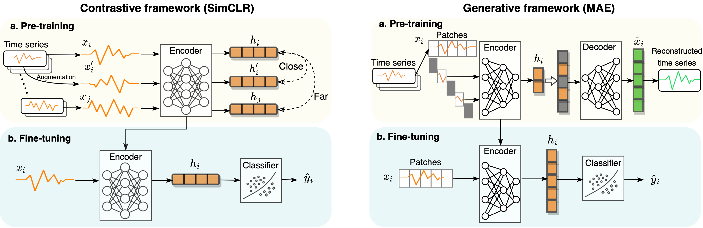

# Self-Supervised Learning for Time Series: Contrastive or Generative?

#### Authors: Ziyu Liu (ziyu.liu2@student.rmit.edu.au), Azadeh Alavi, Minyi Li, Xiang Zhang  
### [Paper Link](https://github.com/AI4TS/AI4TS.github.io/blob/main/CameraReadys%201-22%202/5%5CCameraReady%5CIJCAI23_TSworkshop_Jun29.pdf)
---
<br/>
We hereby release the datasets and corresponding implementation code used in our comparative study of contrastive and generative self-supervised learning methods. This work was published in the AI4TS workshop at IJCAI 2023.


## Overview 
Self-supervised learning (SSL) has recently emerged as a powerful approach to learning representations from large-scale unlabeled data, showing promising results in time series analysis. The self-supervised representation learning can be categorized into two mainstream: contrastive and generative. In this paper, we  **present a comprehensive comparative study between contrastive and generative SSL methods in time series**.

We first introduce the basic frameworks for contrastive and generative SSL, respectively, and discuss how to obtain the supervision signal that guides the model optimization. We then implement classical algorithms (SimCLR vs. MAE) for each type and conduct a comparative analysis in fair settings. Our results provide insights into the strengths and weaknesses of each approach and offer practical recommendations for choosing suitable SSL methods. We also discuss the implications of our findings for the broader field of representation learning and propose future research directions.

<br/>


<center>Frameworks of contrastive and generative self-supervised representation learning</center>

<br/>

## Requirements
See *requirements.txt*.  
To install dependencies, run the following command:  
```pip install -r requirements.txt```

## Running the code
For each dataset, there is a config file (in the folder: `config`) which includes a number of parameters that can be further tuned.  

Take SimCLR as an example, run:  
 `SimCLR_pretrain.py`  for pretraining;  
 `SimCLR_finetune_test.py` for finetuning and testing.

For without pretraining mode, open the config file and find the `finetune options` section, comment out the line: ```pretrain: True```, restore the line: ```pretrain: False```, then run `xx_finetune_test.py`.


## Datasets
- We evaluate the models on HAR (Human Activity Recognition Using Smartphones). The raw dataset can be downloaded [here](https://archive.ics.uci.edu/ml/datasets/Human+Activity+Recognition+Using+Smartphones) which is distributed AS-IS and no responsibility implied or explicitly can be addressed to the authors or their institutions for its use or misuse. Any commercial use is prohibited.

  We cleaned and **processed** the dataset that can be downloaded [here](https://figshare.com/ndownloader/articles/19930244/versions/1).


- To be added

## Acknowledgement
Implemented models are modified for time series based on the following Github repos:
- [SimCLR: PyTorch implementation of SimCLR: A Simple Framework for Contrastive Learning of Visual Representations by T. Chen et al.](https://github.com/Spijkervet/SimCLR)
- [MAE: PyTorch implementation of Masked Autoencoder](https://github.com/IcarusWizard/MAE)


## Cite this paper
If you find this work useful for your research, please consider citing this paper:  

```
@inproceedings{liu2023ssl,
title = {Self-Supervised Learning for Time Series: Contrastive or Generative?},
author = {Ziyu Liu, Azadeh Alavi, Minyi Li, Xiang Zhang},
booktitle = {Workshop on Artificial Intelligence for Time Series, IJCAI 2023},
year = {2023}
}
```

## Future work
In a pursuit of thoroughness and relevance, we pledge to continually enhance our comparative study. This will be achieved by incorporating an increasing quantity and diversity of datasets and by integrating more cutting-edge methodologies into our evaluation.

## Miscellaneous
Please send any questions you might have about the code to ziyu.liu2@student.rmit.edu.au.
